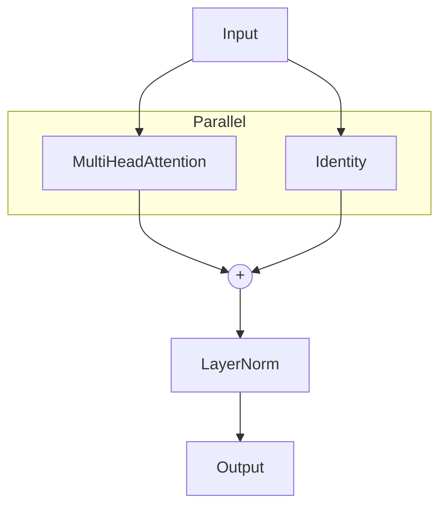

# The `miniml.nn` module

The [`miniml.nn` module](api/miniml/nn/index.md) provides some basic utilities to build simple common ML models. Among these:

* [`miniml.nn.activations`](api/miniml/nn/activations.md) includes common activation functions and an `Activation` layer class that can be used as a container for them;
* [`miniml.nn.linear`](api/miniml/nn/linear.md) contains a basic linear layer;
* [`miniml.nn.mlp`](api/miniml/nn/mlp.md) contains a simple [Multilayer Perceptron](https://en.wikipedia.org/wiki/Multilayer_perceptron);
* [`miniml.nn.compose`](api/miniml/nn/compose.md) contains a `Stack` model that allows to execute sequentially a list of models, passing the output of the previous one as input to the following, a `Parallel` model for running multiple models on the same input and aggregating their output by either concatenation or sum, and convenience `Identity` (returns the input) and `Take` (extracts an index from an axis) models;
* [`miniml.nn.mha`](api/miniml/nn/mha.md) contains a `MultiHeadAttention` layer;
* [`miniml.nn.layer_norm`](api/miniml/nn/layer_norm.md) contains a `LayerNorm` layer;
* [`miniml.nn.rbf`](api/miniml/nn/rbf.md) contains various radial basis functions;
* [`miniml.nn.rbfnet`](api/miniml/nn/rbfnet.md) contains a basic radial basis function net layer;
* [`miniml.nn.embedding`](api/miniml/nn/embedding.md) contains a dictionary embedding block;
* [`miniml.nn.ortho`](api/miniml/nn/ortho.md) contains a `CayleyMatrix` parameter, namely a matrix forced to have orthogonal columns.

Check [the API docs](api/miniml/nn/index.md) for more information.

## Compositing

The compositing layers are particularly convenient for building complex models. For example, consider the need to add a skip connection to a multi-head attention layer, and cap it all with a layer norm. Then you can build:

```py
mha = MultiHeadAttention(n_embed=16, n_head=4)
mha_w_skip = Parallel([mha, Identity()], mode="sum")
lnorm = LayerNorm((16,))
block = Stack([mha_w_skip, lnorm])
```

This will produce the following architecture:



